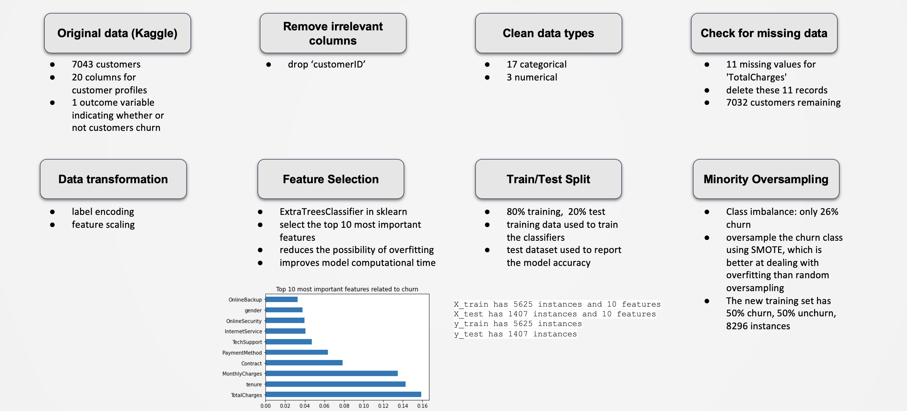
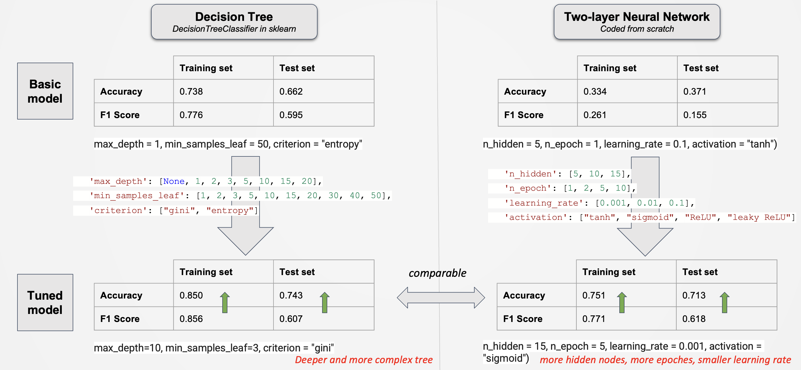

# Telecom Industry -  _Customer Churn Prediction_

## Motivation and Objective

The project's objective is to develop a predictive classifier for customer churn, a significant metric in telecommunications industry. This classifier is an essential element for conducting rigorous analyses of customer tenure and for the quantitative assessment of customer lifetime values. These analyses are critical in determining the financial viability of the company's product and service portfolio.

Furthermore, this classifier will facilitate a more sophisticated approach to customer retention strategies. By identifying customers exhibiting a high likelihood of churn, resource allocation can be optimized, leading to more nuanced and effective retention tactics. 

## Data Cleaning

### Data Loading
Dataset is from Kaggle (https://www.kaggle.com/datasets/blastchar/telco-customer-churn?select=WA_Fn-UseC_-Telco-Customer-Churn.csv). 

The data set includes 7043 customers, 20 columns for customer profiles, and 1 outcome variable indicating whether or not customers churn.

### Data Preparation

The preparation process involves the following steps:

1. Remove any columns that are irrelevant to the customer churn, such as customerID
2. Clean data types
3. Check for missing data and, if any, impute it
4. Use LabelEncoder in sklearn to transform the categorical columns into numerical
5. Feature scaling
6. Use ExtraTreesClassifier in sklearn to select the top 10 most important features to include in the model. This reduces the possibility of overfitting and improves model computational time
7. Split data into 80% training, and 20% test. Training data will be used to train the classifiers, and the remaining 20% test dataset will be used to report the model accuracy
8. Check the distribution of outcome variables in the training set and deal with any class imbalances, such as oversampling the minority class using SMOTE

## Classifer Training
This project focuses on experimenting with two classifiers: decision tree and two-layer neural network.

### Classifer Comparison
Accuracy and f1-score are used to compare the performance of classifiers

1. Decision Tree

    For decision tree, DecisionTreeClassifier in sklearn is simply adopted to train the model, with GridSearchCV in sklearn used to tune the following hyperparameters:

    - max_depth (max. depth of the tree)
    - min_samples_leaf (min. number of samples required at each leaf node)
    - criterion ("gini" or "entropy" used to measure the quality of split)

2. Two-layer Neural Network

    For two-layer neural network, the algorithm is coded from scratch. The following hyperparameters are included in the model: 

    - number of hiddden nodes
    - number of epochs
    - learning rate
    - activation function choice
    
    The best set of hyperparameters is also determined based on the best f1-score obtained on the training dataset.

## Result and Conclusion

1. After hyperparameter tuning, the decision tree model showed slight improvements in accuracy and f1 scores on both the training and testing datasets.

    1.1 The original simple decision tree model used (max_depth = 1, min_samples_leaf = 50, criterion = "entropy"), and showed the following prediction performance:

    - Training Accuracy: 0.738
    - Test Accuracy: 0.662
    - Training F1 Score: 0.776
    - Test F1 Score: 0.595

    1.2 The tuned decision tree classifier is more complex and deeper with (max_depth=10, min_samples_leaf=3, criterion = "gini"), and has the prediction performance as follows:

    - Training Accuracy: 0.850
    - Test Accuracy: 0.743
    - Training F1 Score: 0.856
    - Test F1 Score: 0.607

2. After hyperparameter tuning, the two-layer neural network model improved significantly in accuracy and f1 score.

    2.1 The original two-layer neural network model used (n_hidden = 5, n_epoch = 1, learning_rate = 0.1, activation = "tanh") only has the following prediction performance:
    
    - Training Accuracy: 0.334
    - Test Accuracy: 0.371
    - Training F1 Score: 0.261
    - Test F1 Score: 0.155

    2.2. The tuned two-layer neural network model contains more hidden nodes (n_hidden = 15), more epoches (n_epoch = 5), and a smaller learning rate (learning_rate = 0.001). It also used a different activation function (activation = "sigmoid"). The performance has been improved so that:
    
    - Training Accuracy: 0.751
    - Test Accuracy: 0.713
    - Training F1 Score: 0.771
    - Test F1 Score: 0.618

3. On the testing dataset, the two tuned models had very similar accuracy and f1 scores, with the two-layer neural network having a slightly higher test f1 score.

4. Some additional considerations for increasing prediction power:

    4.1 Both models can be further fine-tuned at a granular level and tested with additional hyperparameters. However, this can significantly increase computational time. 

    4.2 MLP can also be tried to test the accuracy and f1 score.
